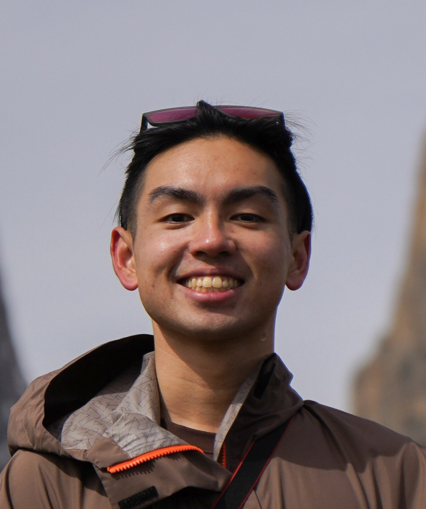
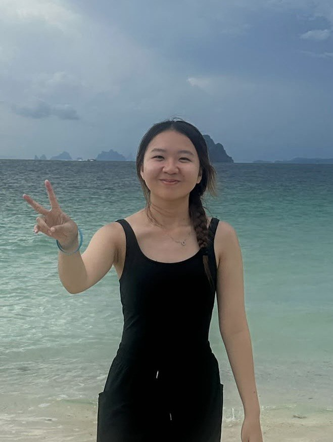
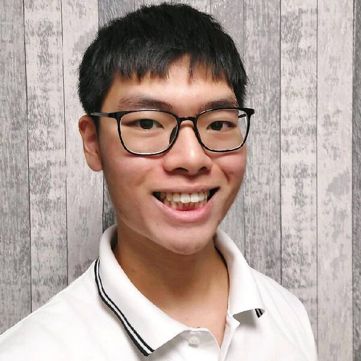

We are a team based in the [School of Computing, National University of Singapore](https://www.comp.nus.edu.sg).

You can reach us at the email `seer[at]comp.nus.edu.sg`

## Project team

### Ryan Ng

[[github](https://github.com/RyanNZZ2205)]

* Role: Scheduling and Tracking
* Responsibilities: Defining, assigning and tracking project tasks

### Cheryl Chow

[[github](http://github.com/Cywez)]

* Role: Documentation
* Responsibilities: Ensure all documentation of the application is sorted and of acceptable quality

### Yang Joonwon

[[github](http://github.com/sheeppocket)]

* Role: Testing
* Responsibilities: Ensure testing of project is done properly and on time

### Chia Kei Pei

[[github](https://github.com/Chia-Kei-Pei)]

* Role: Developer
* Responsibilities: UI

### Renfred Lee

[[github](https://github.com/lzxrenfred)]
[[portfolio](team/lzxrenfred.md)]

* Role: Product & Integration Lead
* Responsibilities: Product requirements, feature specifications, UX consistency, and integration of team contributions.
=======
* Role: Code Quality
* Responsibilities: Ensure adherence to coding standards, look after code quality
