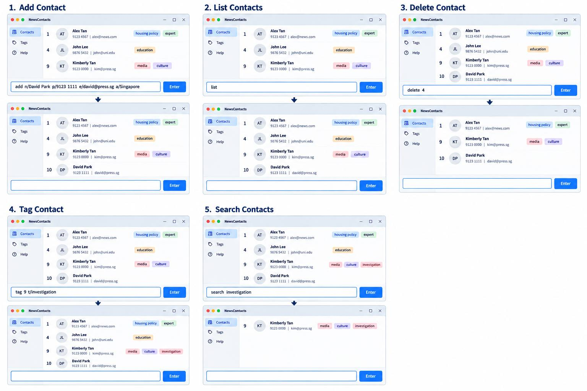

**ByLine is a desktop contact manager for journalists, helping them identify relevant sources and keep track of interviewees for their reporting.** While it has a GUI, most of the user interactions happen using a CLI (Command Line Interface).

* If you are interested in using ByLine, head over to the [_Quick Start_ section of the **User Guide**](UserGuide.html#quick-start).
* If you are interested in developing ByLine, the [**Developer Guide**](DeveloperGuide.html) is a good place to start.

**Acknowledgements**

* ByLine is based on [AddressBook-Level3](https://github.com/se-edu/addressbook-level3) by the [SE-EDU initiative](https://se-education.org).

* Libraries used: [JavaFX](https://openjfx.io/), [Jackson](https://github.com/FasterXML/jackson), [JUnit5](https://github.com/junit-team/junit5)
